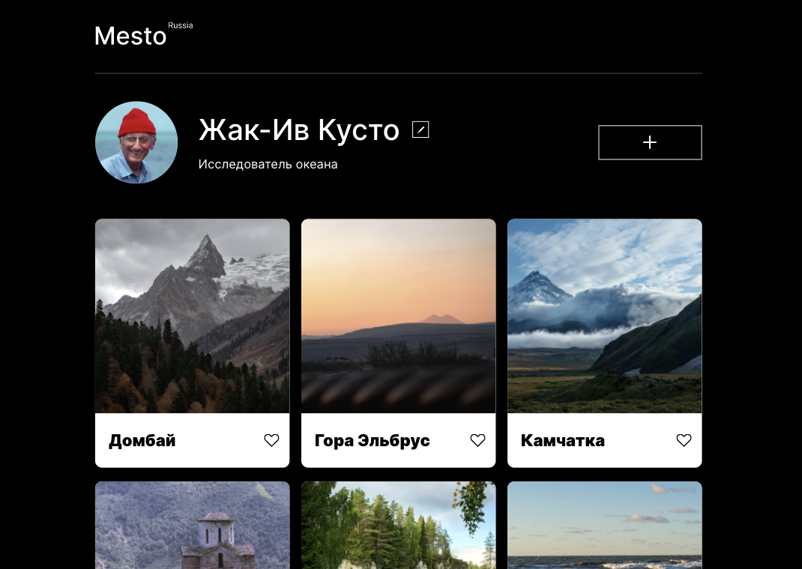

# Проект: Mesto
------------------

[Ссылка на проект](https://thebarbakov.github.io/mesto/index.html)
***

Проект Mesto. Интерактивная страница, куда можно добавлять фотографии, удалять их и ставить лайки.

***
## Основные блоки:
1. Профиль
2. Фотографии
***
## Использованные технологии:
* HTML 5.3
* CSS3
* JavaScrypt
***
## Планы по доработке проекта
1. Доработать функцию выгрузки фотографий.
2. Доработать функцию возмонжости ставить лайки
3. Подключить проект к серверу для его полного функционирования.
